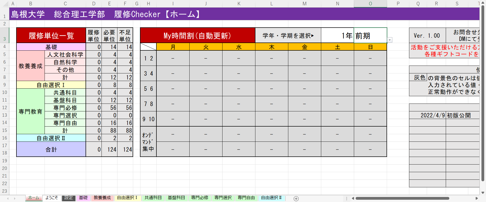
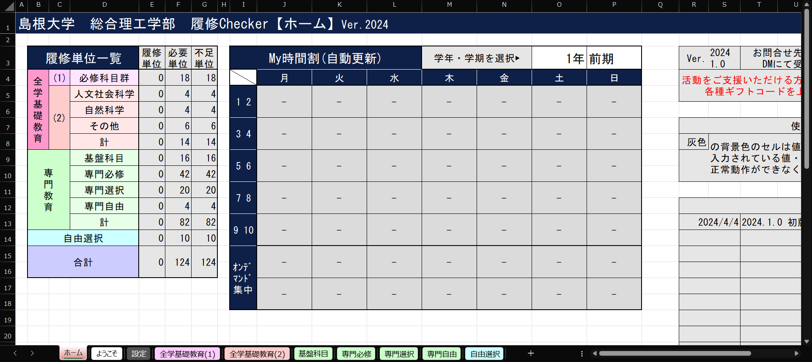

## 1. 概要
　履修状況を簡単に確認できる島大総理生専用ツールです。
##### ver.2022

##### ver.2024

## 2. 使い方
　ご自身の入学年度に合わせたExcelファイルをダウンロードし，画面の指示に従ってご使用ください。

## 3. ダウンロード
##### ver.2022・2023
  
##### ver.2024


## 4. 利用規約
[利用規約ページ](../24091500/)をご覧の上，ご使用ください。

## 5. お問い合わせ
ご不明点等あれば[当サイト管理人Twitter](https://x.com/s_kaziko)まで。
