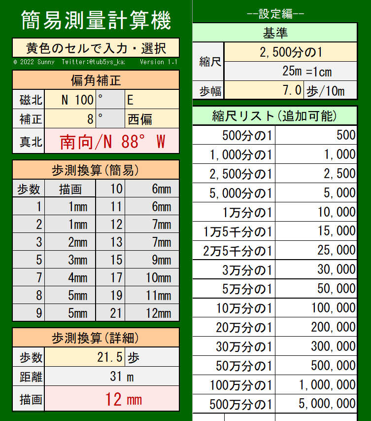

## 1. 概要
　測量時における歩測の計算や偏角補正などを楽に行える地学科向けツールです。

## 2. 使い方
　Excelファイルをダウンロードし，画面の指示に従ってご使用ください。野外で使用しやすいように，スマートフォンでの縦画面使用に最適化しています。

## 3. ダウンロード
  

## 4. 利用規約
[利用規約ページ](../24091302/)をご覧の上，ご使用ください。

## 5. お問い合わせ
ご不明点等あれば[当サイト管理人Twitter](https://x.com/s_kaziko)まで。
