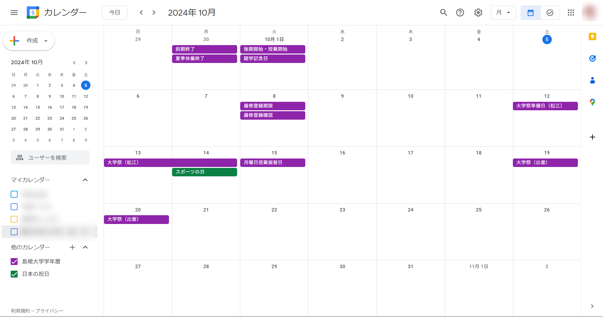
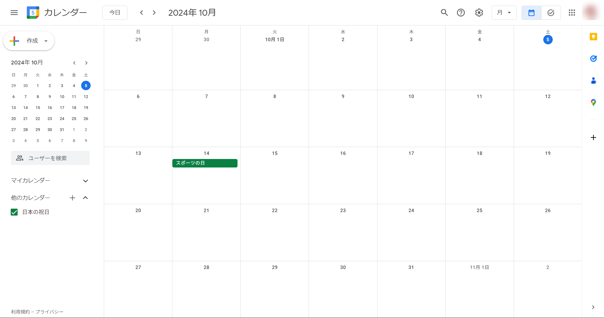
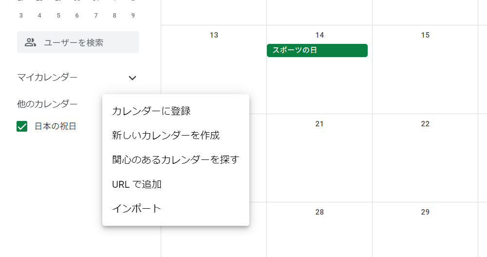
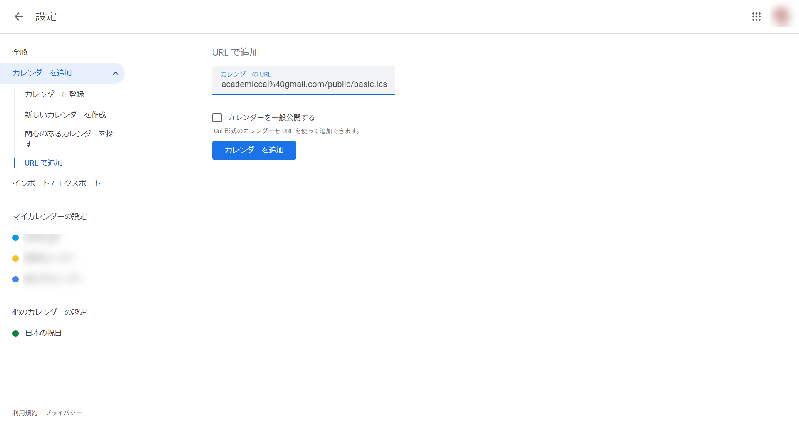

## 学年暦と自分の予定をひとつに
　島根大学では学年暦が[大学のホームページ](https://www.shimane-u.ac.jp/education/academic_calender/calender/)でPDF形式にて公開されていますが，実は個人のGoogleカレンダーに追加することもできるって知っていましたか？  
　今回はその手順をご紹介したいと思います。

##### なお，学年暦については[SHIMASTAR](https://sunsun.earth/univ/shimastar/)からもアクセスできます。

## 手順
### 1.リンクの取得
　[学年暦(Googleカレンダー)](https://www.shimane-u.ac.jp/education/academic_calender/calender/academic_calender99.html)のページからics形式のリンクをコピーする

### 2.Googleカレンダーを開く
　[Googleカレンダー](https://calendar.google.com/calendar/)  
　追加したいアカウントでログインしてください

### 3.URLの追加(1)
　「他のカレンダー」横の＋ボタンより「URLで追加」を選択

### 4.URLの追加(2)
　1.でコピーしたリンクを貼り付けて「カレンダーを追加」する

　これでカレンダーが追加されました！

## ご注意
　大学側が公開しているサービスのため，告知なくサービスが改変・停止・廃止される場合があります。  
　ご不明点等あれば[当サイト管理人Twitter](https://x.com/s_kaziko)まで。
